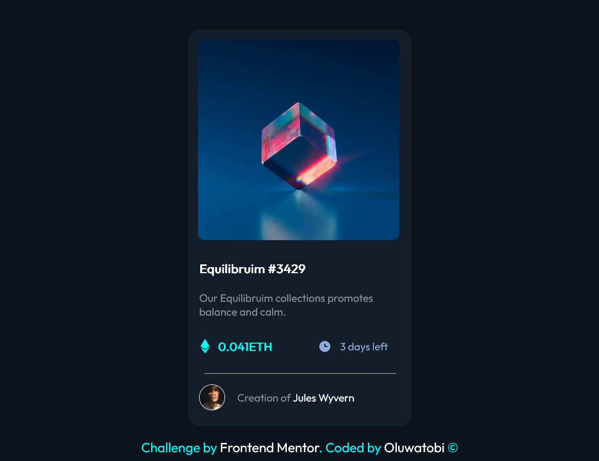

# Frontend Mentor - NFT Preview card component

This is my solution to the [NFT preview card component](https://www.frontendmentor.io/challenges/qr-code-component-iux_sIO_H). Frontend Mentor challenges help you improve your coding skills by building realistic projects. 

## Table of contents

- [Overview](#overview)
  - [Screenshot](#screenshot)
  - [Links](#links)
- [My process](#my-process)
  - [Built with](#built-with)
  - [What I learned](#what-i-learned)
  - [Continued development](#continued-development)
  - [Useful resources](#useful-resources)
- [Usefulness](#usefulness)
- [Acknowledgments](#acknowledgments)


## Overview

This challenge is mainly deasigned to sharpen your CSS knowledge as there are just few `html` tags you will use to complete the challenge.
The major focus is how to position elements, make a responsive page and style an overlay effect on element.

### Screenshot



### Links

- [full code](https://github.com/sammiie/NFT-preview-card).
- [live page](https://sammiie.github.io/NFT-preview-card/)

## My Process

### Built with

The challenge was completed using `html` and `css`   
I used Sublime Text as text editor as code editor while testing with a browser to see how its rendered.

### What I learned

-[flex layout](https://www.w3.org/TR/css-flexbox-1/)
	-flex-direction and  flex-flow
	-align-item, align-content and justify-content
  
  ```css
  body{
	background: #0d131c;
	min-height: 100vh;
	display: flex;
	flex-wrap: wrap;
	justify-content: center;
	align-items: center;
}

#card_details {
	display: flex;
	flex-direction: column;
	background: #141d29;
	width: 270px;
	height: 480px;
	border-radius: 15px;
  ```
  
-[When to use margin vs padding in CSS](https://stackoverflow.com/questions/2189452/when-to-use-margin-vs-padding-in-css)

-[The differences between section and div tags](http://html5doctor.com/the-section-element/)

-[Creating image overlay](https://www.w3schools.com/howto/howto_css_image_overlay.asp)

### Continued Development

- more on CSS box-sizing property
- more CSS flex property
- more CSS grid property
- Bootstrap
- more pseudo elements

### Useful resources

- [ Stack Overflow](https://stackoverflow.com/questions/71875068/how-do-style-an-achor-tag-active-state-wrapped-around-an-image-tag/71875355#71875355) - I have to turn to stack overflow to ask for best way to make the link active state
- [W3schools](https://www.w3schools.com/css/css_positioning.asp) - I consulted this platform as reference for CSS syntax and guide

### Usefulness

This project can be use to make a product preview for ecommerce page.


